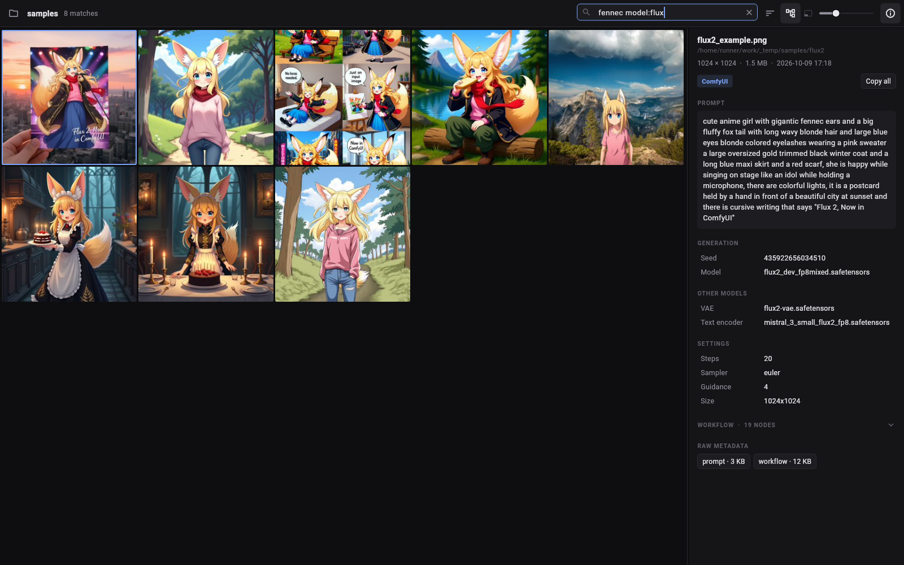

# GenerativeView

A fast image browser for folders of AI-generated images, for Linux and Android.

Point it at an output folder and it shows a resizable grid of everything in it, reads the generation metadata out of each file (ComfyUI, InvokeAI, A1111/Forge), and lets you search the folder by prompt, model, LoRA, seed or file name. Tap any value to copy it.



## What it does

- **Grid** of images and videos from a folder and, optionally, its sub-folders. Resize tiles with the slider, pinch, `Ctrl` + scroll or `Ctrl` `+`/`-`. The crop button (or `C`) switches tiles between cropped-to-fill and showing the whole image.
- **Focus view**: double tap (or `Enter`) opens one image; swipe or use the arrow keys to move through the folder; pinch or `Ctrl` + scroll to zoom; double tap (or `Esc`) to go back.
- **Metadata panel** on the right for the selected image: prompt, negative prompt, seed, model, LoRAs with weights, other models (VAE, text encoders, ControlNet, upscalers), sampler settings, the full ComfyUI node graph, and the raw JSON exactly as stored. Tap a value to copy it. "Copy as tags" gives `<lora:name:weight>`; "Copy all" gives every field as text.
- **Search** across the folder as you type. It matches anywhere inside prompts, models, LoRAs, settings and file names.
- **Live**: images that appear, change or disappear while the folder is open show up in the grid and in search on their own.
- **Folder panel** on the left: a lazily loaded tree, plus a box to paste a path into.

Both side panels collapse; on narrow screens they slide over the grid instead of sitting beside it.

### Search syntax

| Type | Finds |
| --- | --- |
| `red fox` | images whose metadata contains both `red` and `fox` |
| `"red fox"` | the exact phrase |
| `fox -snow` | `fox` but not `snow` |
| `model:flux` | model name contains `flux` (also `lora:`, `prompt:`, `neg:`, `name:`) |
| `seed:1234` | seed starts with `1234` |
| `source:comfyui` | made with that tool (`invokeai`, `a1111`, `forge`, …) |

Matching is case-insensitive and by substring, so `lond` finds `blonde`.

### Keyboard

| Key | Grid | Focus view |
| --- | --- | --- |
| Arrows, `W` `A` `S` `D` | move selection | previous / next image |
| `Enter`, `Space` | open image | back to grid (`Space`: next) |
| `Esc` | clear selection | back to grid |
| `Home` / `End`, `PgUp` / `PgDn` | jump | jump |
| `Ctrl` `F` or `/` | search | |
| `Ctrl` `C` | copy the selected image's prompt | same |
| `Ctrl` `+` / `-` | tile size | |
| `I` or `]` | toggle metadata panel | same |
| `[` | toggle folder panel | |
| `C` | thumbnails cropped to fill / whole image | |
| `F5` | rescan the folder | |

### Metadata it reads

| Tool | Where it looks |
| --- | --- |
| ComfyUI | `prompt` / `workflow` PNG chunks; EXIF in WebP and JPEG; tags in MP4, MOV and WebM (ComfyUI's own video nodes and VideoHelperSuite) |
| InvokeAI | `invokeai_metadata` (v3 and later) and `sd-metadata` (v2) |
| A1111 / Forge | `parameters` PNG chunk; EXIF UserComment in JPEG and WebP |
| Also | SwarmUI, Fooocus and NovelAI basics. Anything unrecognised still appears under "Raw metadata". |

ComfyUI has no fixed schema, so prompts and settings are found by walking the graph back from the sampler. That handles custom samplers, ControlNet, prompt-concatenation and primitive nodes, rgthree's Power Lora Loader and similar; an unusual custom node may still be missed. The full node list and raw JSON are always there to fall back on.

## Install

Every merge to `main` is built, tested and published under [Releases](https://github.com/JRufer/GenerativeView/releases) as `build-<n>`. Grab the newest:

- **Linux**: `GenerativeView-x86_64.AppImage`. Make it executable and run it:

  ```sh
  chmod +x GenerativeView-x86_64.AppImage
  ./GenerativeView-x86_64.AppImage            # or: ./GenerativeView-x86_64.AppImage /path/to/folder
  ```

  `generativeview-linux-x64.tar.gz` is the same app as a plain folder; run `bundle/install.sh` to install it under `~/.local` with a menu entry.

- **Android**: `GenerativeView-arm64-v8a.apk` for tablets and phones. Sideload it.

**Linux needs** GTK 3, and for video `mpv` (playback) and `ffmpeg` (video thumbnails). On CachyOS / Arch:

```sh
sudo pacman -S --needed gtk3 mpv ffmpeg
```

**Android**: on first launch tap **Allow access** and turn on "All files access" for GenerativeView; it needs real folder paths to scan and watch, which Android only gives through that permission. (That permission is also why this is a sideload app rather than a Play Store one.)

### Signing key

Android only installs an update over an existing app if both are signed with the same key. Until the repository has a key of its own, each CI run signs with a throwaway one, and you have to uninstall before installing a newer build. To fix that once:

```sh
keytool -genkeypair -keystore generativeview.jks -storetype PKCS12 -alias generativeview \
  -keyalg RSA -keysize 2048 -validity 10000 -dname "CN=GenerativeView" -storepass 'choose-a-password'

base64 -w0 generativeview.jks | gh secret set ANDROID_KEYSTORE_BASE64 --repo JRufer/GenerativeView
gh secret set ANDROID_KEYSTORE_PASSWORD --repo JRufer/GenerativeView --body 'choose-a-password'
```

Keep `generativeview.jks` somewhere safe and out of the repository. Builds from then on all carry that signature.

## Build from source

You need Flutter 3.47 or newer and a Rust toolchain.

### Linux

```sh
sudo pacman -S --needed clang cmake ninja pkgconf gtk3 mpv ffmpeg rustup   # CachyOS / Arch
flutter build linux --release      # also runs `cargo build --release` for the core
tool/install-linux.sh              # optional: install to ~/.local with a menu entry
tool/build-appimage.sh             # optional: wrap the bundle as a single-file AppImage
```

`generativeview /path/to/folder` opens that folder directly.

### Android

```sh
rustup target add aarch64-linux-android
cargo install cargo-ndk
export ANDROID_NDK_HOME=/path/to/android-sdk/ndk/<version>

tool/build-android-core.sh arm64-v8a          # builds libgvcore.so into android/app/src/main/jniLibs
flutter build apk --release --split-per-abi
```

Run `tool/build-android-core.sh` again whenever something under `core/` changes.

## How it works

```
lib/        Flutter UI (Dart)
core/       Rust library: metadata parsing, index, file watching, thumbnails
```

The UI talks to the core through a small hand-written `dart:ffi` layer (`lib/src/core/native_core.dart` ↔ `core/src/ffi.rs`). Every call is asynchronous, so the UI thread never waits on disk.

- **Metadata** is read without decoding pixels: the core walks the file's chunk or box structure and pulls out the text. Indexing ten thousand PNGs for the first time took about a second on a two-core test machine; reopening the folder took under a tenth of a second.
- **The index** is one SQLite file holding a row per image and its lower-cased search text. Opening a folder answers from the index at once, then compares it with the disk and parses only what is new or changed.
- **Live updates** come from file-system notifications, with a cheap check of folder timestamps every few seconds as a backstop for storage that sends none (Android shared storage, network mounts).
- **Thumbnails** are generated in two sizes on demand, newest request first, and cached on disk. Requests for tiles that scrolled away are dropped. The rest of the folder is pre-rendered in the background at low priority.
- **Grid data** crosses to Dart as one packed buffer that is read in place, so listing ten thousand items costs no parsing.

The index lives in `~/.local/share/com.jrufer.generativeview` and thumbnails in `~/.cache/com.jrufer.generativeview` (on Android, in the app's own storage). Both are caches of what is on disk and can be deleted at any time.

## Development

```sh
cd core && cargo test                                    # parsers, index, watcher, thumbnails
cargo run --release --example dump -- image.png          # print what the core reads from a file
cargo run --release --example bench -- /path/to/folder   # time indexing, search and thumbnails

(cd core && cargo build --release) && flutter test       # the real UI against the real core
xvfb-run -a flutter test integration_test -d linux       # the built app in a virtual display
```

`flutter test` drives the actual app against the actual Rust library on a folder of generated images: it searches, opens the metadata panel, copies values, steps through the focus view and checks that added and deleted files appear and disappear. CI runs the same flow against the built Linux app in a virtual display and against the APK on an emulated Android tablet (`tool/ci-android-emulator.sh`).

Set `GV_SCREENSHOT_DIR` to have the tests save a PNG of each stage, and `GV_SAMPLE_DIR` to point `test/gallery_test.dart` at a folder of your own images.

## Known limits

- Dark theme only.
- Video thumbnails on Linux need `ffmpeg` on the `PATH`; without it videos show a placeholder tile.
- Video metadata is read from MP4, MOV and WebM. Animated WebP and GIF play in the focus view.
- Nothing in the app deletes, moves or edits your files.
